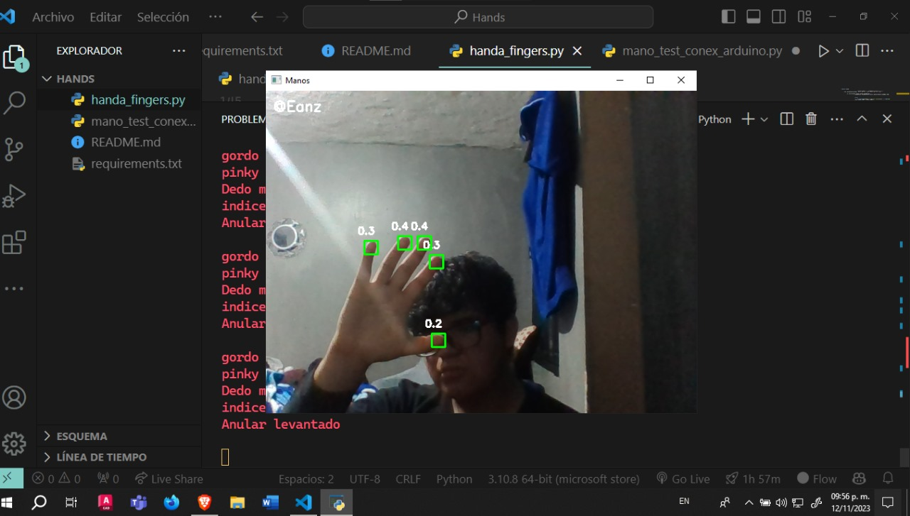

<div aling="center">
 


# Proyecto de visión artificial

<h1 style="color: #232323">Fingers <span style="color:#2ECC71" >Bot</span> </h1>


## Descripción
Este proyecto consiste en un sistema de visión artificial que detecta la posición de la mano en un plano 2D y envía la información a un Arduino UNO para que este mueva un servomotor y recrear el movimiento en la protesis.

## Instalación
Para instalar las librerias necesarias para el proyecto, ejecutar el siguiente comando en la terminal:
```bash
pip install -r requirements.txt
```

## Ejecución
Para ejecutar el programa, ejecutar el siguiente comando en la terminal:
```bash
python handa_fingers.py
```

## Demostración
 

## Requisitos
- Python 3.6 o superior
- OpenCV 4.5.1 o superior
- Arduino IDE
- Arduino UNO
  
## Autores
- Carlos Emmanuel Rodriguez Saldaña
  
## Estado del proyecto
- [x] Inicio del proyecto
- [x] Desarrollo
- [ ] Finalización
- [ ] Documentación
- [ ] Publicación
  
## Contribuciones
Las solicitudes de extracción son bienvenidas. Para cambios importantes, abra un problema primero para discutir qué le gustaría cambiar.

Asegúrese de actualizar las pruebas según corresponda.


[Ver Modelo 3D](URL_de_tu_pagina_html)

<iframe width="100%" height="600" src="img/Diagrama sin título.drawio"></iframe>


## Licencia
[MIT](https://choosealicense.com/licenses/mit/)
Licencia MIT Copyright (c) [2023] [Carlos Emmanuel Rodriguez Saldaña] Por la presente se otorga permiso, sin cargo, a cualquier persona que obtenga una copia de este software y los archivos de documentación asociados (el "Software") para operar con el Software sin restricciones, incluyendo sin limitación, los derechos de usar, copiar, modificar, fusionar, publicar, distribuir, sublicenciar y / o vender copias del Software, y permitir a las personas a las que se les proporcione el Software hacerlo, sujeto a las siguientes condiciones:
- Dar crédito apropiado a [Carlos Emmanuel Rodriguez Saldaña], y a los contribuyentes, para el código fuente original.
- No lucrar o vender copias del software, o partes del software.
- No usar el codigo  para promocionar un producto sin permiso previo por escrito.


</div>
